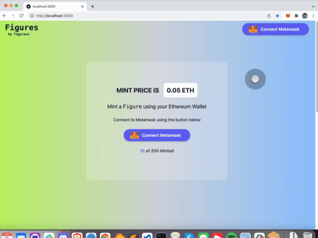

## Figures NFT Collection

Write an NFT contract and mint collectible NFT Figures using Ethereum Wallet.

### Features
- NFT Contract with supply limits. Predefined sale price and presale functionality.
- Deploy contract on a blockchain (local for testing). 
- Connect blockchain with wallet, validate balance and check network chainId.
- Retrieve total NFT supply, show remaining NFT count and check if it is sold out.

**Tokenomics**

- Collection has total 200 NFTs. 
- Maximum 5 mint allowed per transaction. 
- The first 10 Figures are minted for the team, giveaways and community
- Price for each `Figure` 0.05 Ether



**Tech lookup**

Built with Truffle, Tailwind.css and React.

**Requirements**

 [Ganache](https://trufflesuite.com/ganache/) ethereum blockchain is required to run tests.
Assuming Metamask is already installed and test networks enabled.

### Installation

Build and migrate contracts, `truffle-config.json` build directory set to `build-contracts`.

```bash
npm install
truffle compile # Compile contracts
truffle migrate # Migrate contracts `migrations/1_deploy_figurava.js` has initial config
```

After contracts are compiled,  copy contract ABI from compiled artifacts json file to project. 

 `TruffleContract` requires ABI data as constructor parameter so that we can call contract methods.

>  Create ABI script `create_abi.js` is available in the projects home folder.  

After building contracts, pick ABI from contract artifacts and write to `pages/artifacts` directory.

```bash
node create_abi.js
```

That will write contract's ABI and network information to `./pages/artifacts/FiguravaABI.json` file. 


Start the development server on

```bash
npm run dev
```
Visit `http://localhost:3000` to view your application and connect with Metamask.


### Truffle Console

Access deployed contract with truffle console to make sure main sale is started or minter wallets are whitelisted.

```js
truffle console
figurava = await Figurava.deployed()

// if sale not started
figurava.updateMainSaleStatus(true);

// if paused
figurava.start();

// Test mint from an address
figurava.mint("0x3E0e7Ad0f3BE001CcaCeE2891CF135115e32D6b7",1, {from: "0x3E0e7Ad0f3BE001CcaCeE2891CF135115e32D6b7", value: web3.utils.toHex(web3.utils.toWei('0.05', 'ether'))})

// Check how many minted
(await figurava.balanceOf("0x3E0e7Ad0f3BE001CcaCeE2891CF135115e32D6b7")).toString()
```

### Metadata Set Up

Sample NFT defintion metadata files are available at  `metadata` directory.

According to deployed conract's asset server set up in the `migrations/1_deploy_figurava.js`

Those json responses could be used for testing of the deployed asset server.

#### Helpful

[Openzeppelin contract wizard](https://docs.openzeppelin.com/contracts/4.x/wizard) provides a quick boilerplate for NFT contract creation. 
[Figurava](https://figurava.com) has some more posts.

